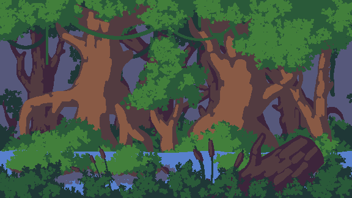
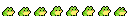
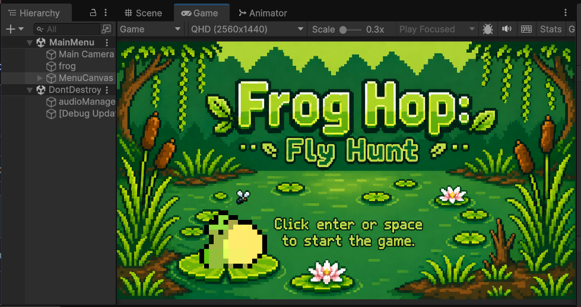
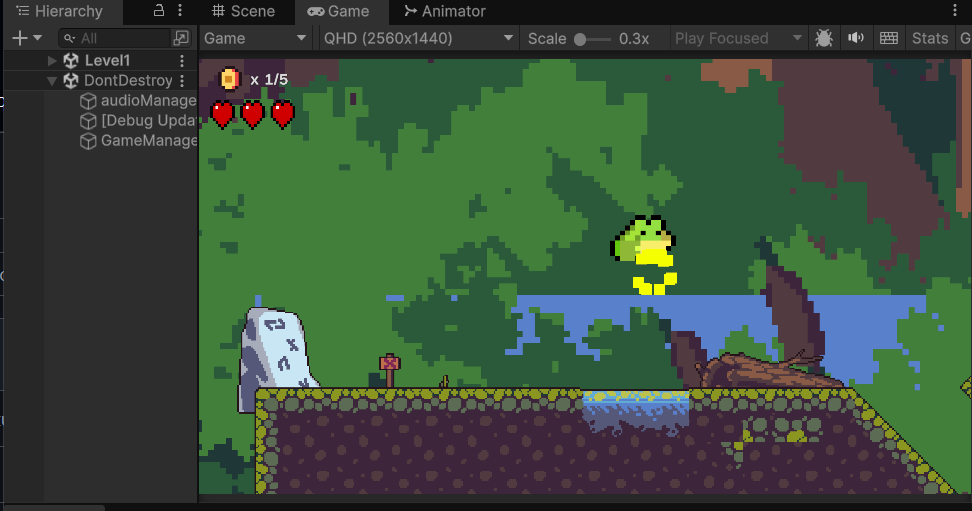
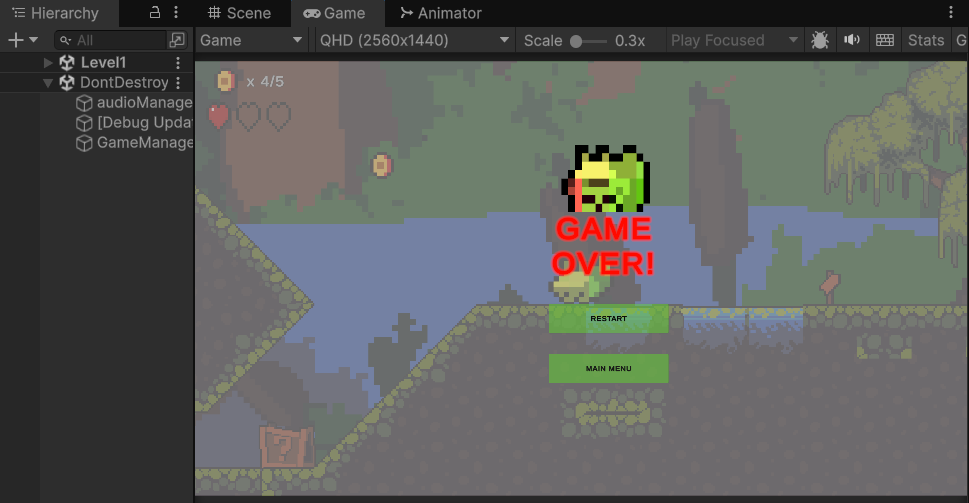
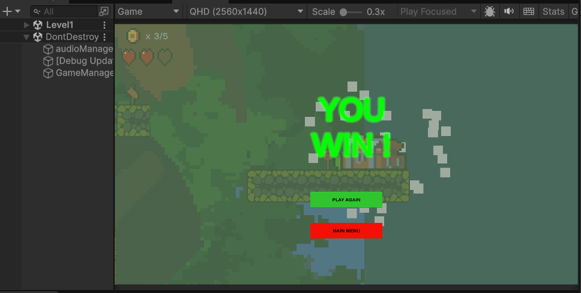

<div align="center">



# 🐸 Frog Hop: Fly Hunt



**A cozy 2D swamp platformer — hop across lily pads, dodge the water, and hunt down every fly.**

[](https://unity.com/)
[]()
[]()
[]()
[]()
[](https://holmes-99.itch.io/frog-hop-fly-hunt)

<!--
🎬 Want a gameplay GIF too? Record a short clip (10-15s) of a full level run,
   convert it (ScreenToGif / ezgif.com, keep it < 8MB), drop it in Screenshots/,
   then add it above the table below.
-->

</div>

---

## 📸 Screenshots

| Main Menu | Gameplay |
|---|---|
|  |  |

| Game Over | You Win |
|---|---|
|  |  |

---

## 🎮 About

**Frog Hop: Fly Hunt** is a hand-crafted 2D platformer built in **Unity 6** with the **Universal Render Pipeline (2D)**. Guide a hungry little frog across a swamp level — jump between platforms, collect flies for points, avoid falling into the water, and reach the win zone to complete the level.

Built solo as a focused, polished platformer with real "game juice": camera shake on death, particle bursts on collection and victory, animated UI, and a full sound pass.

## ✨ Features

| | |
|---|---|
| 🐸 | Tight, responsive frog movement with jump physics |
| 🪰 | Fly/coin collectible system with pickup particles & SFX |
| 🗺️ | Hand-painted swamp tilemap level design |
| 💀 | Death zone (water) with Cinemachine camera-shake impulse |
| 🏆 | Win zone with animated treasure chest + celebration particles |
| 🔊 | Full audio pass — music, jump, collect, win, and lose SFX |
| 🖥️ | Animated main menu with polished UI |
| ⚙️ | Centralized `GameManager` / `UIManager` / `AudioManager` architecture |

## 🕹️ Controls

| Action | Key |
|---|---|
| Move Left / Right | `A` / `D` or `←` / `→` |
| Jump | `Space` |
| Pause / Menu | `Esc` |

## 🧰 Built With

- **Engine:** Unity 6000.4.1f1
- **Render Pipeline:** Universal Render Pipeline (2D Renderer)
- **Camera:** Cinemachine (impulse-based screen shake)
- **UI Text:** TextMesh Pro
- **Systems:** 2D Tilemap, 2D Animation, New Input System

## 📂 Project Structure

```
Assets/
├── Animations/     # Frog, coin, chest & UI animation controllers
├── Audio/          # Music and SFX
├── Prefabs/        # Coin, particles, reusable objects
├── Scenes/         # MainMenu, Level1
├── Scripts/        # Gameplay & manager scripts
├── Settings/        # URP render pipeline settings
├── Sprites/        # Frog, tileset, backgrounds, UI, flies, items
└── Tilemaps/       # Swamp tile palette & layout
```

### Core Scripts

| Script | Responsibility |
|---|---|
| `PlayerMovement.cs` | Frog movement, jump, ground detection |
| `CoinCollectible.cs` | Pickup detection, particles, SFX, score |
| `GameManager.cs` | Lives, coins, win/lose state (singleton) |
| `UIManager.cs` | HUD updates |
| `AudioManager.cs` | Centralized music/SFX playback (singleton) |
| `DeathZone.cs` | Water trigger, camera shake, death SFX |
| `WinZone.cs` | Win trigger, chest animation, win particles |
| `MainMenu.cs` / `MenuBGAnimator.cs` | Menu navigation & animated background |

## 🚀 Getting Started

1. Install **Unity 6000.4.1f1** (or newer 6.x) via Unity Hub.
2. Clone the repo:
   ```bash
   git clone https://github.com/Holmes-99/FrogHopFlyHunt.git
   ```
3. Open the project folder in Unity Hub → **Open** → select the cloned folder.
4. Open `Assets/Scenes/MainMenu.unity` and hit ▶️ Play.

## 📦 Download / Play

| Platform | Link |
|---|---|
| 🌐 itch.io | [holmes-99.itch.io/frog-hop-fly-hunt](https://holmes-99.itch.io/frog-hop-fly-hunt) |

## 🗺️ Roadmap

- [ ] Additional levels
- [ ] Mobile touch controls
- [ ] Leaderboard / best time tracking
- [x] itch.io release

## 📄 License

This project is licensed under the MIT License — see the [LICENSE](LICENSE) file for details. Third-party assets retain their original licenses (see `Assets/TextMesh Pro/Fonts/LiberationSans - OFL.txt`).

---

<div align="center">

Made with 🐸 and Unity by [Holmes-99](https://github.com/Holmes-99)

</div>
